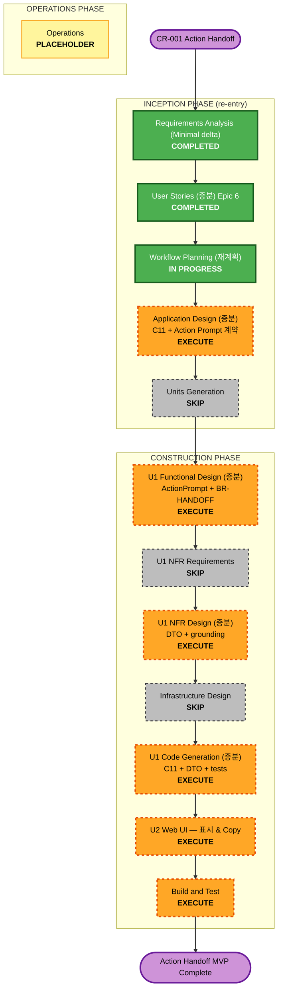

# CR-001 Action Handoff — Execution Plan Delta (Workflow Planning 재계획)

> **Workflow Planning (재계획) 산출물** for CR-001 Product Scope Change.
> 원본 `aidlc-docs/inception/plans/execution-plan.md`는 **미수정(동결)**한다 — 이 delta가 CR-001 재진입에 대해 authoritative.
> 근거: `CR-001-action-handoff.md` §4~§5(승인됨), `CR-001-requirements-delta.md`(APPROVED, FR-11/FR-12/NFR-8+§3.1), `stories.md` Epic 6(US-6.1/US-6.2, APPROVED).
> Base 워크플로우 상태(격리 체크포인트 `f347c2c`): U1 Code Generation Step 0~11 완료, U2 미구현, Build & Test 미실행.

---

## 1. Detailed Analysis Summary (delta)

### Transformation Scope
- Greenfield 유지 — Reverse Engineering N/A. 신규 유닛 없음. **기존 U1(Advisor Backend, 코드 존재) + U2(Web UI, 미구현)** 에 걸친 **append-only 기능 추가**(C7 EvidenceBuilder 직후 Action Handoff 단계).

### Change Impact Assessment
- **User-facing changes**: **Yes** — 결과 화면에 Action Prompt 표시 + Copy(성공/실패 구분). (US-6.2 / FR-12)
- **Structural changes**: **Yes (경미)** — U1 파이프라인 끝에 신규 컴포넌트 C11 ActionHandoffBuilder 삽입(append-only). 유닛 경계(2 units) 불변.
- **Data model changes**: **Yes (신규 엔티티)** — `ActionPrompt`(decisionState, promptText, groundingRefs → 접근 가능한 Evidence/Candidate). 기존 도메인 엔티티 미변경.
- **API changes**: **Yes (형태 미확정)** — Advisor 응답에 Action Prompt 포함. `/advise` 확장 vs 신규 엔드포인트 및 필드명은 **Application Design(증분)에서 확정**(스토리 AC는 특정 경로·필드 미전제).
- **NFR impact**: **Yes** — Evidence-grounded 비노출 확장(NFR-8 + §3.1 UNAVAILABLE↔NEEDS REVIEW 경계), 공개 DTO 내부필드 비노출 원칙 유지, demoMode 결정성 유지. Tech stack·Extension 설정 **불변**.

### Component Relationship (U1 → U2 계약)
- **Primary(변경)**: U1 Advisor Backend — 신규 C11 ActionHandoffBuilder, orchestrator가 C7 직후 호출, 공개 응답 DTO 확장.
- **Dependent(소비)**: U2 Web UI — Advisor 응답의 Action Prompt를 소비하여 표시·Copy. **U1이 계약 제공자**, U2가 소비자.
- **Coordination Point**: Advisor 응답의 Action Prompt 계약(필드/형태) — Application Design(증분)에서 확정 후 U1 구현 → U2 소비.
- **Non-Regression 대상**: C1~C8 파이프라인 / BR-RANK / BR-OVERALL / BR-STATE / evaluationStatus(UNAVAILABLE) 계약 / PBT P1~P11 — **변경 없이 동작**해야 함.

### Risk Assessment (delta)
- **Risk Level**: **Low~Medium** — append-only 추가로 기존 파이프라인 격리. 주요 불확실성: (a) Action Prompt 생성 품질(LLM/템플릿 방식은 설계 결정), (b) evidence-grounding 비노출 불변식 준수, (c) U2 미구현 상태에서의 표시/Copy 신규 구현.
- **Rollback Complexity**: **Easy** — C11 및 DTO 필드 제거로 원상복구(append-only, 기존 결과 비의존).
- **Testing Complexity**: **Moderate** — Decision 4종 × Prompt 목적, evidence-grounding 불변식, 생성 실패 시 결과 유지(비차단), append-only 비회귀 검증.

---

## 2. Update Strategy (U1 → U2 Coordination)

- **Update Approach**: **Sequential** — U1 계약 확정·구현 → U2 소비.
- **Critical Path**: Application Design(증분)의 Action Prompt 응답 계약 확정 → U1 Functional/NFR/Code(증분) → U2 표시/Copy.
- **Coordination Points**: Advisor 응답의 Action Prompt 필드/형태(설계 확정).
- **Testing Checkpoints**: U1 단위(Decision×목적, grounding, 비차단) → U1+U2 통합(표시/Copy) → Build & Test 전체(비회귀 포함).

---

## 3. CR-001 재진입 스테이지 판정 (Phase Determination)

> 근거: CR-001 §5 승인 순서. 각 스테이지는 표준 승인 게이트(Request Changes / Continue to Next Stage)를 거친다. 깊이는 해커톤 MVP + append-only 특성상 **Minimal/경량**.

### 🔵 INCEPTION PHASE
| 스테이지 | 판정 | 깊이 | Rationale |
|---|---|---|---|
| Workspace Detection | ✅ COMPLETED | — | Greenfield 1회 확정, 재실행 불필요 |
| Reverse Engineering | ⬜ N/A | — | Greenfield |
| Requirements Analysis (Minimal delta) | ✅ COMPLETED (APPROVED) | Minimal | FR-11/FR-12/NFR-8(+§3.1). `CR-001-requirements-delta.md` |
| User Stories (증분) | ✅ COMPLETED (APPROVED) | 증분 | Epic 6 US-6.1/US-6.2 append-only |
| **Workflow Planning (재계획)** | 🔵 IN PROGRESS | 경량 | **본 문서** — delta 스테이지·깊이 확정 |
| **Application Design (증분)** | 🟠 EXECUTE | 증분 | 신규 C11 ActionHandoffBuilder, Action Prompt 응답 계약(API 형태 확정), U2 표시 책임, `component-methods.md`/`services.md`/`unit-of-work-story-map.md`(Epic 6 매핑 추가) 갱신 |
| **Units Generation** | ⬜ SKIP | — | 새 유닛 없음(U1/U2 재사용). 유닛 경계 불변 — 매핑 갱신은 Application Design에서 처리 |

### 🟢 CONSTRUCTION PHASE
| 스테이지 | 판정 | 깊이 | Rationale |
|---|---|---|---|
| **U1 Functional Design (증분)** | 🟠 EXECUTE | 증분 | `ActionPrompt` 엔티티, BR-HANDOFF(Decision별 목적), evidence-grounding 규칙, §3.1 경계, 생성 실패 비차단, C7 이후 신규 step |
| **U1 NFR Requirements** | ⬜ SKIP | — | Tech stack 확정(`tech-stack-decisions.md`)·Extension 설정 불변(delta §5). 신규 NFR은 NFR-8(비노출 확장)뿐이며 requirements delta에 이미 문서화 → 신규 NFR *요구* 도출 불요 |
| **U1 NFR Design (증분)** | 🟠 EXECUTE | 증분 | 공개 DTO에 Action Prompt 추가(내부필드 비노출 유지), evidence-grounded(환각 금지) 패턴, demoMode 결정성, PBT 후보(Decision→Prompt 목적 매핑=순수·결정적) |
| **Infrastructure Design** | ⬜ SKIP | — | mock/로컬, 클라우드 프로비저닝 없음(기존과 동일) |
| **U1 Code Generation (증분)** | 🟠 EXECUTE (ALWAYS) | 증분 | `app/components/action_handoff.py`(C11), orchestrator C7 직후 호출, 공개 응답 DTO 확장, Decision 4종·grounding·비차단·비회귀 테스트, `code-summary.md` 갱신 |
| **U2 (Web UI — 착수 시 Action Handoff 반영)** | 🟠 EXECUTE | (U2 전체 빌드) | U2 미구현 — base 플랜의 U2 빌드에 Action Prompt 표시 + Copy(성공/실패 구분) + Prompt 부재 시 기존 결과 유지 포함(US-6.2) |
| **Build and Test** | 🟠 EXECUTE (ALWAYS) | — | U1(Action Handoff 포함) 빌드·테스트, 기존 U1 회귀 테스트 유지 + append-only 검증 |

### 🟡 OPERATIONS PHASE
- Operations — PLACEHOLDER

---

## 4. Workflow Visualization (CR-001 재진입)



### Text Alternative (always included)

```
INCEPTION PHASE (CR-001 re-entry)
- Requirements Analysis (Minimal delta) ... COMPLETED (APPROVED)
- User Stories (증분) Epic 6 .............. COMPLETED (APPROVED)
- Workflow Planning (재계획) .............. IN PROGRESS (this document)
- Application Design (증분) ............... EXECUTE  (C11 + Action Prompt 응답 계약 + U2 표시 책임)
- Units Generation ....................... SKIP     (새 유닛 없음)

CONSTRUCTION PHASE
- U1 Functional Design (증분) ............. EXECUTE  (ActionPrompt 엔티티 + BR-HANDOFF + grounding)
- U1 NFR Requirements .................... SKIP     (tech stack·extension 불변)
- U1 NFR Design (증분) .................... EXECUTE  (공개 DTO + evidence-grounded + 결정성)
- Infrastructure Design .................. SKIP     (mock/로컬)
- U1 Code Generation (증분) ............... EXECUTE  (C11 + DTO + 테스트 + code-summary)
- U2 Web UI — 표시 & Copy ................. EXECUTE  (Action Prompt 표시 + Copy 성공/실패 + 부재 시 결과 유지)
- Build and Test ......................... EXECUTE  (Action Handoff 포함 + 기존 회귀 유지 + append-only 검증)

OPERATIONS PHASE
- Operations ............................. PLACEHOLDER
```

---

## 5. Stages to Execute / Skip (요약)

**EXECUTE (6)**: Application Design(증분) · U1 Functional Design(증분) · U1 NFR Design(증분) · U1 Code Generation(증분) · U2 표시/Copy · Build & Test.

**SKIP (4)**: Units Generation(새 유닛 없음) · U1 NFR Requirements(tech stack·extension 불변) · Infrastructure Design(mock/로컬) · Reverse Engineering(Greenfield, N/A).

**COMPLETED (3)**: Workspace Detection · Requirements Analysis(Minimal delta) · User Stories(증분).

---

## 6. Estimated Timeline
- **잔여 실행 스테이지**: 6 (AD → U1 FD → U1 NFRD → U1 CG → U2 → BT).
- **Estimated Duration**: 해커톤 MVP 경량 — 설계 게이트 신속 통과, 구현(CG)·U2·검증(BT)에 시간 집중. append-only라 기존 파이프라인 재작업 없음.

## 7. Success Criteria
- **Primary Goal**: 재사용 판단 결과(현재 산출된 Overall Decision + 근거)를 근거로 **실행 가능한 단일 Action Prompt를 생성·표시·Copy**하는 append-only 흐름을 U1+U2 E2E로 동작.
- **Key Deliverables**: C11 ActionHandoffBuilder, Action Prompt 응답 계약, U2 표시/Copy UI, Decision 4종 × 목적 검증, evidence-grounding 비노출 불변식, 생성 실패 비차단.
- **Quality Gates**:
  1. Decision 4종(REUSE/EXTEND/DEVELOP/NEEDS REVIEW) 각 목적별 Prompt 대표 케이스.
  2. Evidence-grounding 비노출(미인가·후보별 내부정보 미노출) + §3.1 경계(UNAVAILABLE→NEEDS REVIEW 후보 비식별 일반 문구) 검증.
  3. Action Prompt 생성 실패 시 기존 Decision·Evidence·랭킹 유지(비차단) 검증.
  4. 기존 U1 파이프라인/랭킹/Overall/State/PBT(P1~P11) 비회귀.
  5. Copy 성공("복사됨")/실패(수동 복사 대안) UX.

---

## 8. Open Points for Application Design (증분)
- **API 형태 확정**: `/advise` 응답 확장 vs 신규 엔드포인트, 필드명(예: `actionHandoff`/`actionPrompt`) — 스토리 AC는 미전제.
- **Prompt 생성 방식**: LLM 생성 vs 템플릿 기반 vs 혼합 (Functional/NFR Design에서 확정; PBT는 Decision→목적 매핑의 순수·결정 부분 대상).
- **C11 배치**: orchestrator에서 C7 EvidenceBuilder 직후 호출 지점 및 실패 격리(비차단) 처리.
