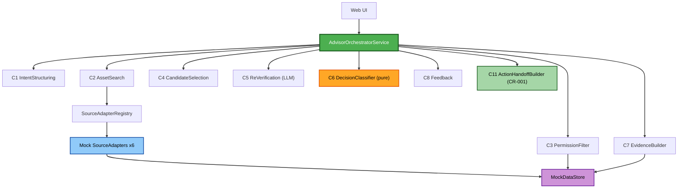

# Component Dependency — Rebuild or Reuse Advisor

> 의존성 매트릭스 + 통신 패턴 + 데이터 흐름.
> 통신 패턴: 동기 순차 in-process 호출(Q5-A). Orchestrator가 각 컴포넌트를 조율.

---

## 의존성 매트릭스

| Depends → | Orchestrator(S1) | C1 Intent | C2 Search | C3 PermFilter | C4 Select | C5 ReVerify | C6 Classifier | C7 Evidence | C8 Feedback | Registry(S2) | C9 Adapter | C10 Store |
|---|---|---|---|---|---|---|---|---|---|---|---|---|
| **Web UI** | ✅ | | | | | | | | | | | |
| **Orchestrator (S1)** | — | ✅ | ✅ | ✅ | ✅ | ✅ | ✅ | ✅ | ✅ | | | |

> *(CR-001 증분)* **Orchestrator (S1) → C11 ActionHandoffBuilder**: ✅ 신규(C7 EvidenceBuilder 직후 호출, 비차단). **C11 → 외부**: 없음(공개 투영 ranking/evidenceChains만 소비) 또는 LLMClient(생성 방식이 LLM일 경우 — Functional/NFR Design에서 확정). MockDataStore 직접 의존 없음.
| **C2 Search** | | | — | | | | | | | ✅ | (via S2) | |
| **C3 PermFilter** | | | | — | | | | | | | | ✅ |
| **C5 ReVerify** | | | | | | — | | | | | | (LLM 외부) |
| **C7 Evidence** | | | | | | | | — | | | | ✅ |
| **C9 Adapter (mock)** | | | | | | | | | | | — | ✅ |
| **Registry (S2)** | | | | | | | | | | — | ✅ | |

(✅ = 행이 열에 의존/호출. 빈 칸 = 의존 없음)

**핵심 관측**:
- Web UI는 **Orchestrator에만** 의존(단일 진입점, Q6-A).
- C6 DecisionClassifier는 **외부 의존 없는 순수 로직** → PBT 최적 대상(NFR-5).
- MockDataStore(C10)는 C3(권한)·C7(Evidence)·C9(Adapter)가 공유하는 데이터 소스.
- 확장 지점은 C9/S2 뒤에 격리 → 실제 Source 전환 시 상위 파이프라인 무변경(NFR-3, US-5.2).

---

## 데이터 흐름 (Data Flow) — ASCII

```
 [Web UI]
   |  rawText
   v
 submitIntent() --> C1 IntentStructuring --(StructuredIntent | ClarificationRequest)--> [Web UI]
                                                        |
                                    (사용자 승인/수정 후 approvedIntent + PermissionContext)
                                                        v
 advise() ── Orchestrator (동기 순차) ──────────────────────────────────────────────
   |
   |  (1) intent
   +--> C2 AssetSearch --(via S2 Registry)--> C9 Mock Adapters x6 --(reads)--> C10 MockDataStore
   |        <-- Candidate[] (전체)
   |
   |  (2) candidates + ctx
   +--> C3 PermissionFilter --(reads asset perms)--> C10 MockDataStore
   |        <-- { accessible[], excluded[] }
   |
   |  (3) accessible + N
   +--> C4 CandidateSelection --> Top-N   (accessible==0 -> DEVELOP 경로 표시)
   |
   |  (4) Top-N + intent
   +--> C5 ReVerification --(LLM)--> VerifiedCandidate[] (score + reasoning)
   |
   |  (5) verified
   +--> C6 DecisionClassifier (pure) --> candidateStates + overallDecision
   |
   |  (6) verified + states + ctx
   +--> C7 EvidenceBuilder --(reads)--> C10 MockDataStore --> EvidenceChain[]
   |
   |  (7) ranking 조립 (State->Score->name)
   |  (8) [CR-001] intent + overall + rationale + ranking + evidenceChains
   +--> C11 ActionHandoffBuilder --> ActionPrompt   (try/except -> None, 비차단)
   |
   +--> (9) AdviceResult { ranking, overallDecision, evidenceChains, [actionPrompt?] }
            |
            v
        [Web UI]  (랭킹 + Overall + Evidence + Action Prompt(표시/Copy) 단일 화면)
            |  feedback
            v
     submitFeedback() --> C8 Feedback (기록)
```

---

## 통신 패턴 다이어그램 (Mermaid)



**Text alternative**: Web UI는 Orchestrator만 호출한다. Orchestrator는 C1~C8을 순차 호출하고, *(CR-001 증분)* C7 직후 C11 ActionHandoffBuilder를 비차단 호출한다. C2는 Registry를 통해 6개 Mock Adapter를 호출하고, Adapter는 MockDataStore를 읽는다. C3(권한)와 C7(Evidence)도 MockDataStore를 읽는다. C6은 외부 의존이 없는 순수 로직이다. C11은 접근 가능 공개 투영(ranking/evidenceChains)만 소비한다.
