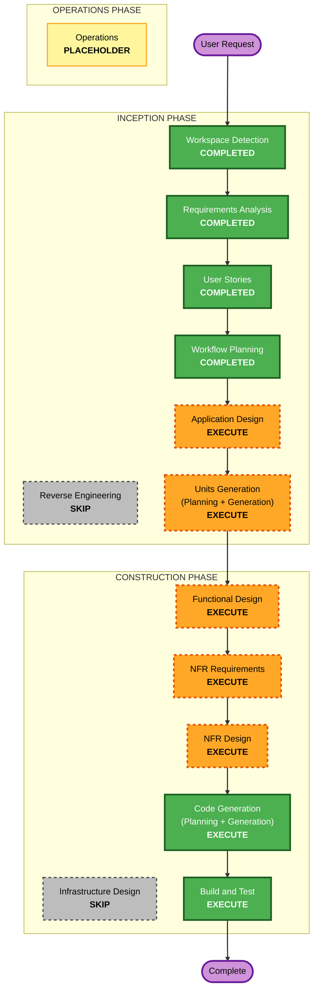

# Execution Plan — Rebuild or Reuse Advisor

> Greenfield / Hackathon MVP (약 6시간, Token Budget USD 1,000).
> 근거 문서: requirements.md(FR-1..10, NFR-1..7), stories.md(5 Epic / 15 story), personas.md(P1 Developer, P2 Business User).
> **정합성 참고**: Consistency Check(audit 참조)에서 C-1(권한 필터 위치), C-2(Candidate vs Overall Decision) 불일치가 확인되었고, User 결정(C)에 따라 문서 미수정으로 진행한다. **분기 지점에서는 개정된 stories.md를 authoritative 모델로 본다.**

---

## Detailed Analysis Summary

### Transformation Scope
- Greenfield — Reverse Engineering N/A. 신규 웹 애플리케이션 + 백엔드 Advisor 파이프라인 + mock 자산/권한 데이터.

### Change Impact Assessment
- **User-facing changes**: Yes — 자연어 Intent 입력, 랭킹·Decision·Evidence 비교 화면(FR-1, FR-10).
- **Structural changes**: Yes — 신규 시스템 전체 구조 정의 필요(Intent 구조화 → 검색 → 권한 필터 → Top-N → LLM 재검증 → Decision → Evidence).
- **Data model changes**: Yes — Intent 구조(Role/Goal/Function/Data/Output), Asset/Candidate, Candidate State, Overall Decision, Evidence, mock permission context.
- **API changes**: Yes — 신규 엔드포인트(Intent 제출/구조화, 검색·재검증, 결과·Evidence, 피드백).
- **NFR impact**: Yes — 확장성(Source Adapter 구조, NFR-3), 테스트성(PBT 부분, NFR-5), 사용성(단일 화면, NFR-6), 예산/시간(NFR-2).

### Risk Assessment
- **Risk Level**: Medium — 신규·다중 컴포넌트이나 Greenfield(롤백 부담 낮음)·mock 데이터. 주요 불확실성: (a) 6시간 시간 예산, (b) LLM 재검증 판단 품질, (c) mock 권한 모델의 대표성.
- **Rollback Complexity**: Easy (기존 코드 없음).
- **Testing Complexity**: Moderate — 순수 판단 로직(권한 필터·Decision 분류)은 PBT/대표 케이스, LLM 부분은 대표 mock 시나리오 중심.

### 이월된 열린 결정 (Open Decisions)
- **A-2 (권한별 Source 노출 세부 정책)**: requirements.md에서 "Workflow Planning에서 재결정"으로 이월. 
  - **권장안**: MVP는 **자산 단위(per-asset) 권한 모델**로 통일 — 각 mock 자산이 허용 Role/User 목록을 가지며, Source 단위 접근은 자산 단위에서 파생. 별도 Source-level 정책 레이어는 두지 않음(6h 제약).
  - 세부 스키마는 **Application Design / Functional Design**에서 확정. (승인 게이트에서 이 권장안 확인)

---

## Workflow Visualization



### Text Alternative (always included)

```
INCEPTION PHASE
- Workspace Detection ....... COMPLETED
- Reverse Engineering ....... SKIP (Greenfield)
- Requirements Analysis ..... COMPLETED
- User Stories .............. COMPLETED
- Workflow Planning ......... COMPLETED (this document)
- Application Design ........ EXECUTE
- Units Generation .......... EXECUTE

CONSTRUCTION PHASE (per-unit loop)
- Functional Design ......... EXECUTE
- NFR Requirements .......... EXECUTE
- NFR Design ................ EXECUTE
- Infrastructure Design ..... SKIP (mock data, no cloud provisioning for MVP)
- Code Generation ........... EXECUTE (always)
- Build and Test ............ EXECUTE (always)

OPERATIONS PHASE
- Operations ................ PLACEHOLDER
```

---

## Phases to Execute

### 🔵 INCEPTION PHASE
- [x] Workspace Detection (COMPLETED)
- [x] Reverse Engineering (SKIPPED — Greenfield)
- [x] Requirements Analysis (COMPLETED)
- [x] User Stories (COMPLETED)
- [x] Execution Plan (IN PROGRESS → COMPLETED on approval)
- [ ] Application Design — **EXECUTE**
  - **Rationale**: 신규 컴포넌트/서비스(Intent 구조화, Multi-Source 검색+Adapter, 권한 필터, LLM 재검증, Decision 분류, 결과/Evidence API, Web UI)와 각 컴포넌트 메서드·비즈니스 규칙·의존성 정의 필요. Source Adapter 확장 구조(NFR-3) 설계 필요.
- [ ] Units Generation — **EXECUTE (lightweight)**
  - **Rationale**: 신규 데이터 모델·API·복잡 판단 로직·다중 모듈 존재 → 구조적 분해가 유익. 단, 6h 제약상 **소수 유닛(권장 1~2개: ① Advisor 파이프라인 백엔드, ② Web UI)** 으로 최소화하여 per-unit 루프 반복을 억제. 최종 유닛 수는 Units Generation 단계에서 확정.

### 🟢 CONSTRUCTION PHASE (각 유닛별 루프)
- [ ] Functional Design — **EXECUTE**
  - **Rationale**: 신규 데이터 모델(Intent 구조, Candidate, Candidate State/Overall Decision, Evidence, mock permission)과 핵심 비즈니스 로직(권한 필터, Top-N 선별, 재검증, Decision 분류) 상세 설계 필요.
- [ ] NFR Requirements — **EXECUTE**
  - **Rationale**: Tech stack 선정(Web + 백엔드 + LLM 연동), 확장성(Source Adapter), 테스트성(PBT 부분, NFR-5), 사용성(단일 화면), 예산/시간 제약 반영 필요.
- [ ] NFR Design — **EXECUTE**
  - **Rationale**: NFR Requirements 실행에 따라 Source Adapter 패턴·PBT 적용 지점·단일화면 UX 패턴을 설계에 반영.
- [ ] Infrastructure Design — **SKIP**
  - **Rationale**: MVP는 mock 데이터·로컬/단순 호스팅 전제, Resiliency 확장 skip(Q10), 6h 제약. 클라우드 리소스/배포 아키텍처 상세는 불필요. (Production 전환 시 별도 수행)
- [ ] Code Generation — **EXECUTE (ALWAYS)**
  - **Rationale**: 실제 구현 계획 및 코드 생성.
- [ ] Build and Test — **EXECUTE (ALWAYS)**
  - **Rationale**: 빌드·단위/통합 테스트·핵심 시나리오 검증(PBT 부분 + 대표 mock 케이스).

### 🟡 OPERATIONS PHASE
- [ ] Operations — PLACEHOLDER

---

## Estimated Timeline
- **Total Stages to Execute**: 8 (AD, UG, FD, NFR-Req, NFR-Design, CG, BT + 잔여 Inception 승인)
- **Estimated Duration**: 해커톤 MVP 약 6시간 (설계 산출물은 경량 depth로 시간 예산에 맞춤). 설계 게이트는 빠르게, 구현(CG)·검증(BT)에 시간 집중.

## Success Criteria
- **Primary Goal**: Persona 무관 공통 Reusability 흐름(자연어 Intent → 구조화 → 검색 → 권한 필터 → Top-N → LLM 재검증 → Candidate State/Overall Decision → 랭킹+Evidence)을 웹 단일 화면에서 End-to-End 동작시키는 MVP.
- **Key Deliverables**: 웹 UI, Advisor 백엔드 파이프라인, mock 자산/권한 데이터, 추적 가능한 Evidence chain, 핵심 판단 로직 테스트.
- **Quality Gates**: 3개 Unhappy 시나리오(권한 제외 / NEEDS REVIEW / DEVELOP) 각 대표 mock 케이스 검증, Evidence chain 자기설명성(NFR-1), PBT 부분 적용(NFR-5).
